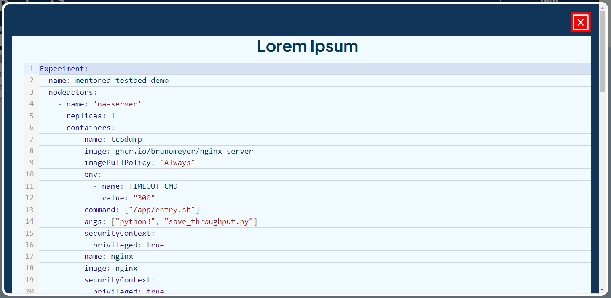
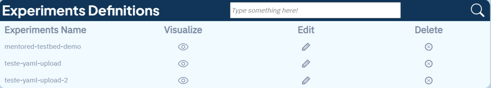

## How to view and manage experiment definitions

When accessing the experiments screen, you will see a list with all the experiment definitions you have created. Additionally, on this screen, it is possible to define a new experiment by clicking on the "New Definition" button.

## Viewing the experiment code
To view the code of an experiment, simply click on the eye icon of the desired definition in the list. The code will then be displayed in a PopUp in YAML format. The PopUp will look like this:

## Editing the experiment code
If it is necessary to make any changes to the experiment definition, you can edit the code by clicking on the "Edit" icon in the column. This will open an editor where the changes can be made. After making the changes, save the file so that the changes can be applied. 
<!-- The Editor will look like this

 -->

## Deleting an experiment definition
If a certain experiment definition is no longer needed, it is possible to delete it by clicking on the "Delete" option next to the desired definition in the list of experiments. Make sure to confirm the action to avoid accidentally deleting an important definition. 
<!-- After deleting, this message will be displayed:

 -->