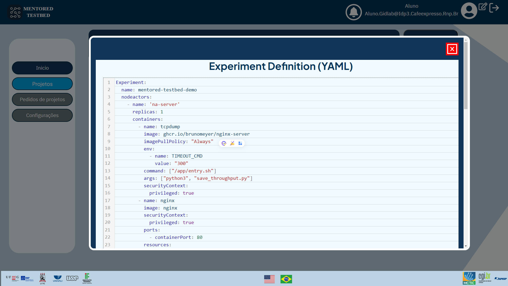

## Como visualizar e gerenciar definições de experimentos

Ao acessar a tela de experimentos, você verá uma lista com todas as definições de experimentos criadas por você. Além disso, nessa tela, é possível definir um novo experimento clicando no botão "Nova definição".

## Visualização do código do experimento
Para visualizar o código de um experimento, basta clicar no ícone de olho da definição desejada na lista. O código será exibido em um PopUp. O PopUp terá a seguinte aparência:

## Edição do código do experimento
Se for necessário fazer alguma alteração na definição do experimento, você poderá editar o código clicando no ícone "Editar" na coluna. Isso abrirá um editor no qual as alterações poderão ser feitas. Após fazer as alterações, salve o arquivo para que as alterações possam ser aplicadas. 
<!-- O Editor terá a seguinte aparência

Código de edição de definição de experimentos](img/experiment-definition-page-edit-pt.png "Código de edição de definição de experimentos") -->

## Exclusão de uma definição de experimento
Se uma determinada definição de experimento não for mais necessária, é possível excluí-la clicando na opção "Excluir" ao lado da definição desejada na lista de experimentos. Certifique-se de confirmar a ação para evitar a exclusão acidental de uma definição importante. 
<!-- Após a exclusão, esta mensagem será exibida:

 -->