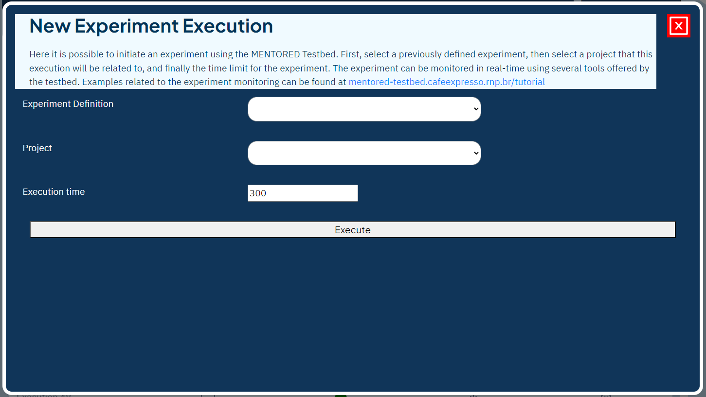

To run an experiment in the MENTORED Testbed, follow these steps:

Click the New Execution button, as indicated in the image.

After clicking the button, a PopUp will open with information about the experiment's execution.

In this PopUp, you will find the necessary fields to request the execution of the experiment. First, select the definition of the experiment you want to run. Then, choose which project this run will be associated with and set a time limit in seconds for the run.

Finally, click "Run" and the PopUp will close. From the settings list, you can view and follow the experiment run in real-time using the Real Time Monitor. To learn more about the Real Time Monitor, please refer to the link [Real Time Monitor](monitoring.md).

With these steps, you can now run your experiments on the MENTORED Testbed.