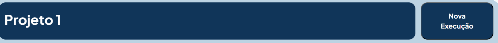
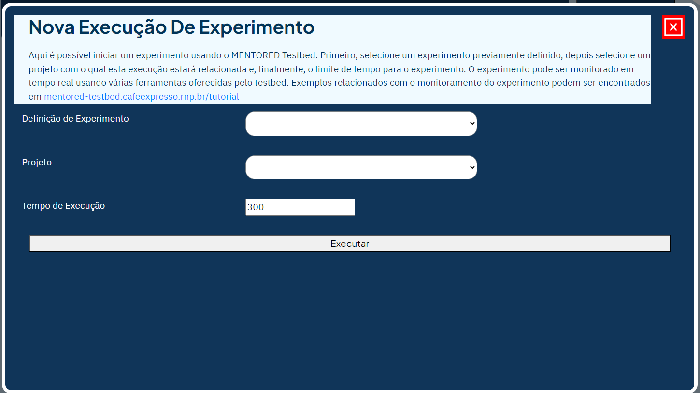

Para executar um experimento no MENTORED Testbed, siga estas etapas:

Clique no botão Nova execução, conforme indicado na imagem.

Após clicar no botão, um PopUp será aberta com informações sobre a execução do experimento.

Nesse PopUp, você encontrará os campos necessários para solicitar a execução do experimento. Primeiro, selecione a definição do experimento que deseja executar. Em seguida, escolha a qual projeto essa execução será associada e defina um limite de tempo em segundos para a execução.

Por fim, clique em "Executar" e a janela PopUp será fechada. Na lista de configurações, você pode visualizar e acompanhar a execução do experimento em tempo real usando o Monitor em Tempo Real. Para saber mais sobre o Monitor em Tempo Real, consulte o link [Monitor em Tempo Real](monitoring.md).

Com essas etapas, agora você pode executar seus experimentos no MENTORED Testbed.