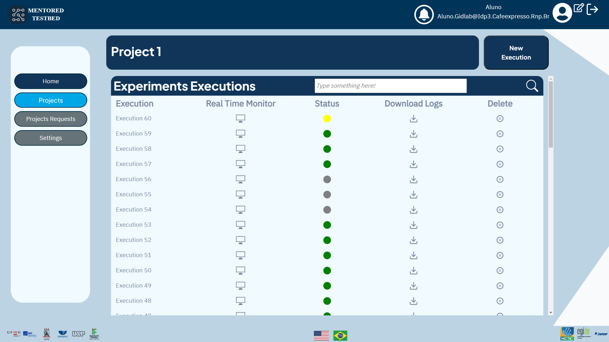
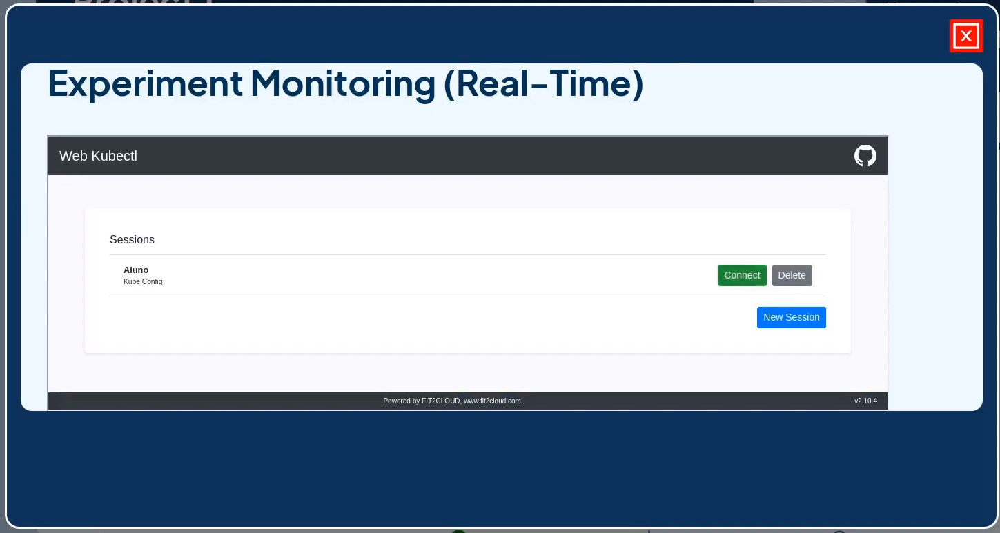
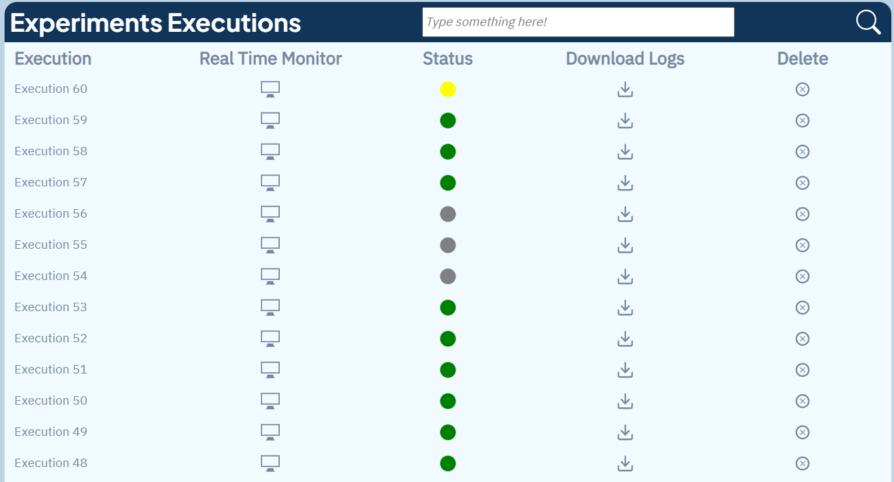

## How to View and Manage Experiment Executions

When accessing the experiment execution screen, you will see a list of all previously defined experiments. Additionally, on this screen, you can request the execution of an experiment by clicking on the "New Execution" button.

## Real-Time Experiment Monitoring

To perform real-time monitoring, the user can monitor the attack in real-time using the Web Kubectl tool, with more detailed monitoring available at [Real Time Monitor](monitoring.md).

## Checking Experiment Status

In addition, you can check the status of the experiment through the colors displayed in the status column:

- Gray means the experiment has not yet been executed.
- Yellow means the experiment is currently being executed.
- Red means the experiment was executed, but an error occurred during execution.
- Green means the experiment was executed without errors and was completed.

<!--## Downloading Experiment Logs

Next to the status column, you will find a button to download the experiment logs.

  -->

## Deleting an Experiment Execution

Finally, there is the option to delete an experiment's execution. To do so, simply click on the "Delete" option next to the desired execution in the experiment list. Be sure to confirm the action to avoid accidentally deleting an important execution.

<!--  -->