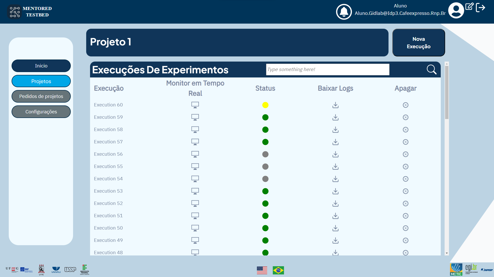
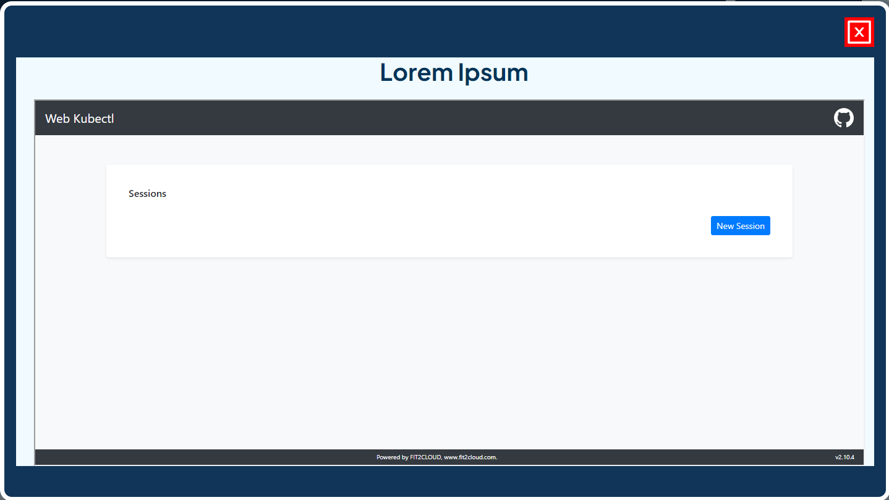
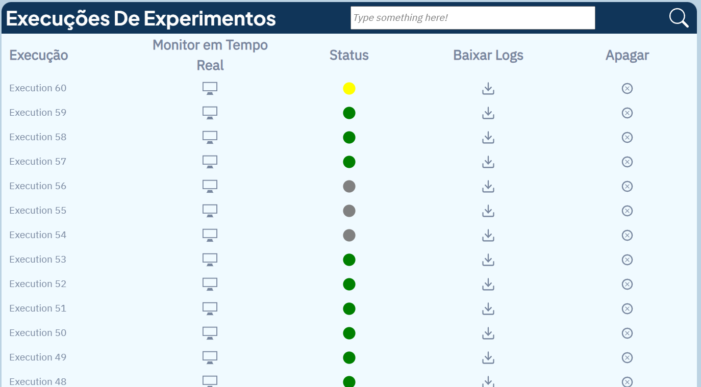

## Como visualizar e gerenciar execuções de experimentos

Ao acessar a tela de execução de experimentos, você verá uma lista de todos os experimentos definidos anteriormente. Além disso, nessa tela, você pode solicitar a execução de um experimento clicando no botão "Nova Execução".

## Monitoramento de experimentos em tempo real

Para executar o monitoramento em tempo real, o usuário pode monitorar o ataque em tempo real usando a ferramenta Web Kubectl, com monitoramento mais detalhado disponível em [Monitor em Tempo Real](monitoring.md).

## Verificação do status do experimento

Além disso, você pode verificar o status do experimento por meio das cores exibidas na coluna de status:

- Cinza significa que o experimento ainda não foi executado.
- Amarelo significa que o experimento está sendo executado no momento.
- Vermelho significa que o experimento foi executado, mas ocorreu um erro durante a execução.
- Verde significa que o experimento foi executado sem erros e foi concluído.

<!--## Download de registros de experimentos

Ao lado da coluna de status, você encontrará um botão para fazer download dos registros do experimento.

  -->

## Exclusão de uma execução de experimento

Por fim, há a opção de excluir a execução de um experimento. Para isso, basta clicar na opção "Excluir" ao lado da execução desejada na lista de experimentos. Não se esqueça de confirmar a ação para evitar a exclusão acidental de uma execução importante.

<!--  -->