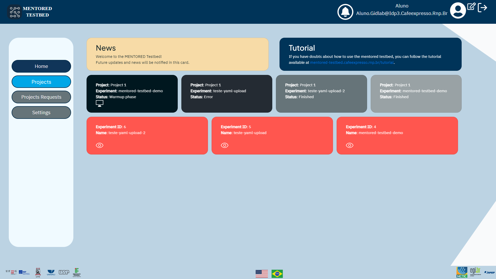
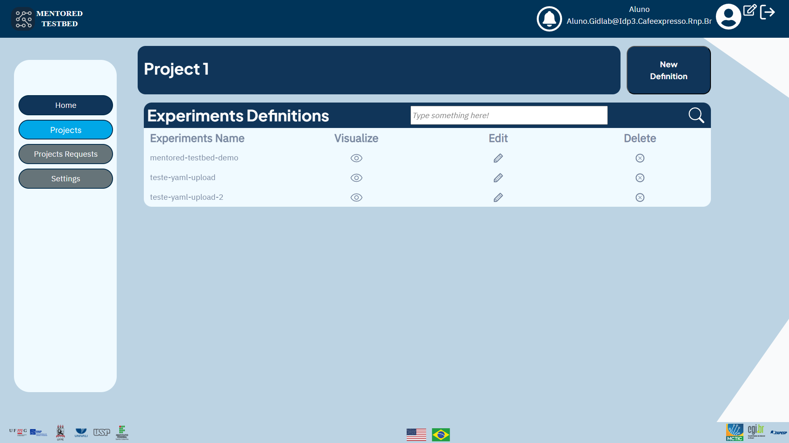

## The MENTORED Testbed dashboard

When you access [https://portal.mentored.ccsc-research.org/](https://portal.mentored.ccsc-research.org/), you will be taken to a home screen that contains several cards with relevant information. This information includes news about the testbed, a link to this tutorial, and a carousel with details about running the experiments. Below the carousel, you will find another carousel with a list of experiments and important details about each experiment. The dashboard looks like this:

Looking at the portal's homepage, we can highlight some important details that will be present constantly:

- In the portal header, there is a shortcut to notification, information about the user's username and email, settings, and the logout button.

- In the sidebar, which is where the navigation between the functionalities of the portal is performed, you can access the home page, the experiments runs and their settings, make project requests, and access the dashboard settings.

- On the footer of the page are located the logos and redirections to the MENTORED Project's partner institutions, as well as the portal's translation buttons, since it has both Portuguese and English support. On the right side of the footer are the project's funding institutions.

## Experiments definition page

Upon accessing the experiment's definition page, you can start setting up your own experiment. On this page, you will find a list of all the experiments defined previously, separated by project. This allows you to have an overview of the existing projects and access the specific settings of each one of them. To learn more about how to set up a new experiment, go to the [Experiment Definition page](definition.md).

## Experiments execution page

On the experiment's execution page, you have the possibility of requesting the start of the previously defined experiment. This page provides an overview of all the experiments that have already been defined and allows you to run them. The list of experiments is organized by project, making it easy to find and select the desired experiment. To learn more about how to conduct an experiment, go to the [Experiment Execution page](execution.md).

