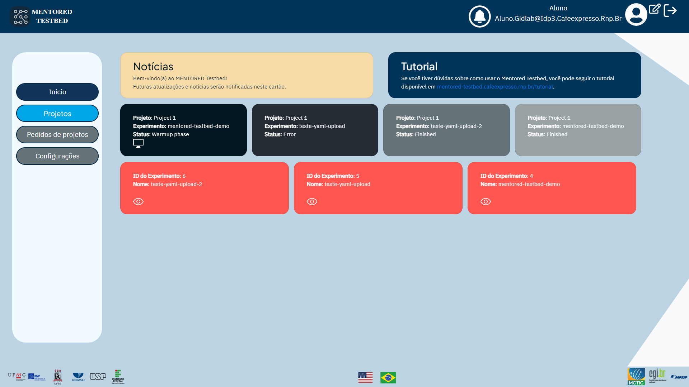
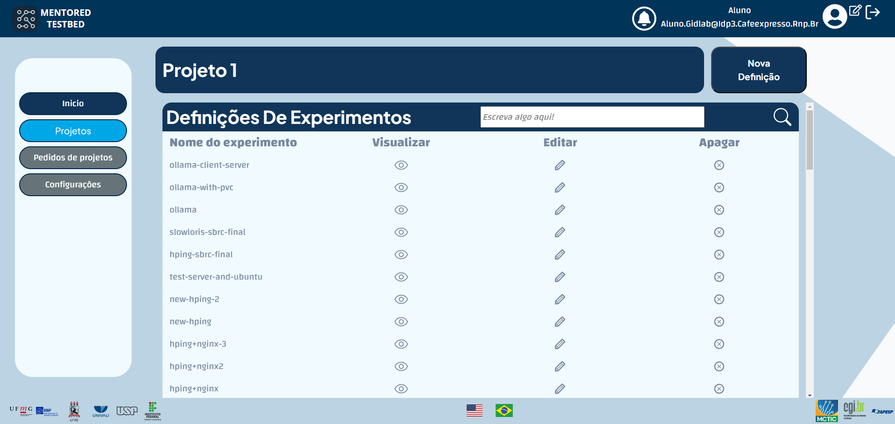

## Pagina inicial do MENTORED Testbed

Ao acessar [https://portal.mentored.ccsc-research.org/](https://portal.mentored.ccsc-research.org/), você será levado a uma tela inicial que contém vários cartões com informações relevantes. Essas informações incluem notícias sobre o testebed, um link para este tutorial e, abaixo, um carrossel com detalhes sobre a execução dos experimentos. Abaixo do carrossel, você encontrará outro carrossel com uma lista de experimentos com detalhes importantes sobre cada experimento. O painel de controle tem a seguinte aparência:

Observando a página inicial do portal, podemos destacar alguns detalhes importantes que estarão presentes constantemente:

- No cabeçalho do portal, há um atalho para as mensagens recebidas, informações sobre o nome de usuário e o e-mail do usuário, configurações e o botão de logout.

- Na barra lateral, que é onde se realiza a navegação entre as funcionalidades do portal, é possível acessar a home, os experimentos, as configurações e as execuções, fazer solicitações de projetos e acessar as configurações.

- No rodapé da página estão localizados os logotipos e redirecionamentos para as instituições parceiras do MENTORED Project, bem como os botões de tradução do portal - já que ele possui versões em português e inglês. No lado direito do rodapé estão as instituições financiadoras do projeto.

## Página de definição de experimentos

Ao acessar a página de definição de experimentos, você pode começar a configurar o seu próprio experimento. Nessa página, você encontrará uma lista de todos os experimentos definidos anteriormente, separados por projeto. Isso permite que você tenha uma visão geral dos projetos existentes e acesse as configurações específicas de cada um deles. Para saber mais sobre como configurar um novo experimento, acesse a página [Experiment definition page](definition.md).

## Página de execução de experimentos

Na página de execução de experimentos, você tem a possibilidade de solicitar o início de um experimento definido anteriormente. Essa página fornece uma visão geral de todos os experimentos que já foram definidos e permite executá-los. A lista de experimentos é organizada por projeto, facilitando a localização e a seleção do experimento desejado. Para saber mais sobre como conduzir um experimento, acesse a página [Experiment execution] (execution.md).

