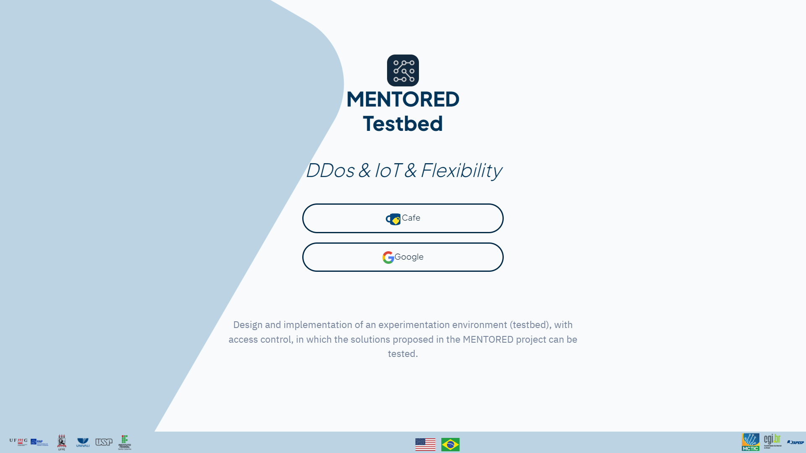
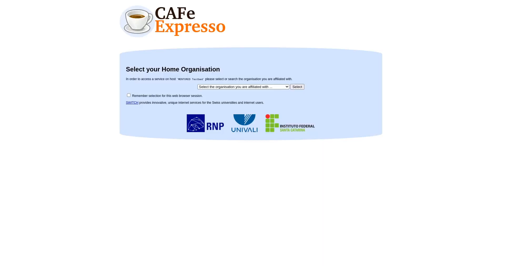
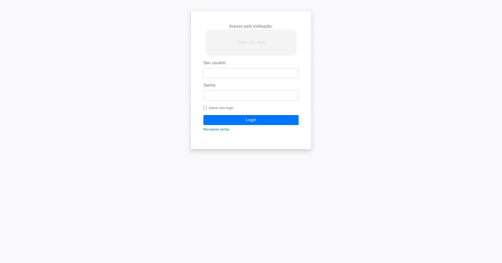

To login, you must initially choose the desired login option; currently, the MENTORED Testbed is only working with federated authentication via CAFe.

When you choose the CAFe login option, you will be redirected to the following screen:

<!-- To access the list of all the institutions available on CAFe, access the link: [https://ajuda.rnp.br/cafe/lista-clientes](https://ajuda.rnp.br/cafe/lista-clientes) -->

You can verify if your institution is on the [list](https://ajuda.rnp.br/cafe/lista-clientes) that has CAFe access.

After choosing your institution, you will be redirected to the home page through your institution credentials.

Once you have logged in, you can choose the project in which you want to conduct your experiments. If you do not have any projects, you must create one. If you do not have any projects and have the privilege of project administrator, you can create a project. Otherwise, you should ask a project administrator to add you to a project.

Succeeding these steps, you are ready to start using the MENTORED Testbed.
