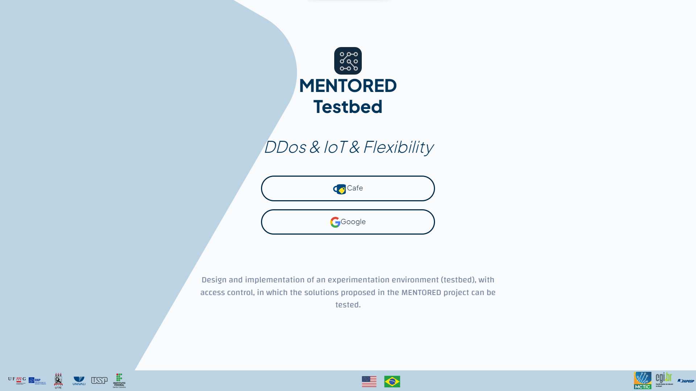
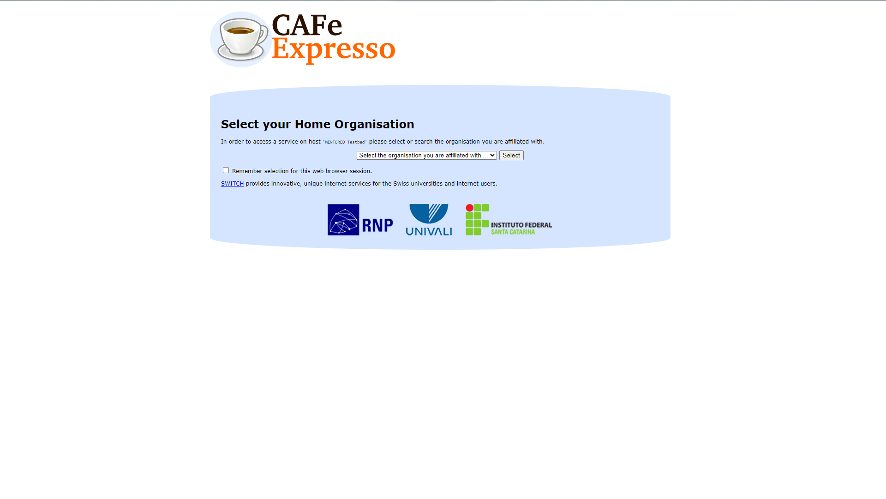
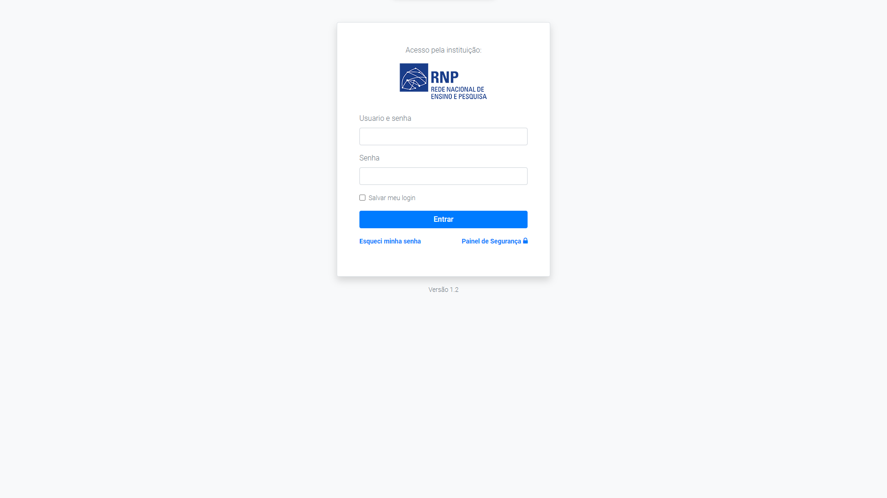

Para fazer login, você deve inicialmente escolher a opção de login desejada. Atualmente, o MENTORED Testbed está funcionando apenas com autenticação federada via CAFe.

Ao escolher a opção de login da CAFe, você será redirecionado para a tela a seguir:

Para acessar a lista com todas as instituições disponíveis na CAFe, acesse o link [https://ajuda.rnp.br/cafe/lista-clientes](https://ajuda.rnp.br/cafe/lista-clientes)

Após a escolha será feito um redirecionamento para que o login seja feito por meio das credenciais da instituição escolhida

Após fazer o login, você poderá ser redirecionado para escolher o projeto no qual deseja realizar seus experimentos. Se você não tiver nenhum projeto, deverá criar um novo. Se você tiver o privilégio de administrador do projeto, poderá criar o projeto. Caso contrário, deverá pedir a um administrador de projeto que o adicione ao projeto.

Após essas etapas, você estará pronto para começar a usar o MENTORED Testbed