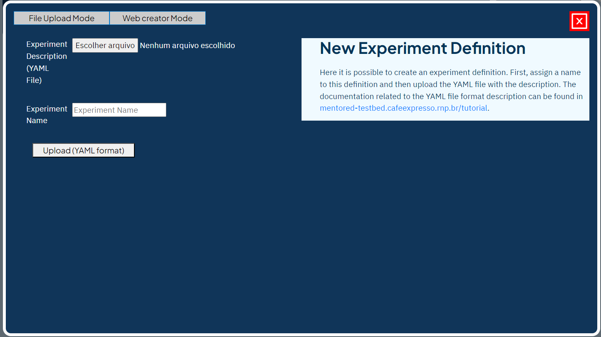

To create a new experiment in the MENTORED Testbed, follow these steps:

Click the "New Definition" button, as indicated in the image.

After clicking the button, a PopUp will open with information about the creation of the experiment.

Currently, the only way to create an experiment is by uploading the .yaml file that contains the topology of the experiment. You can find detailed information on how to set up and write this file [How to create the YAML file?](yaml.md).

Click on the "Choose file" button to open the file explorer and choose the .yaml file you want to use. Then, in the "Experiment Name" field, type the name you want to give the definition.

Finally, click on "Upload (YAML format)". After this, the PopUp will close, and the list of definitions will be updated with the newly created definition.

Through these steps, you can create a new experiment in the MENTORED Testbed.