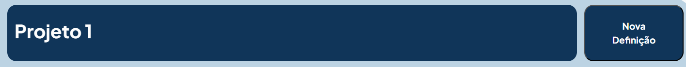
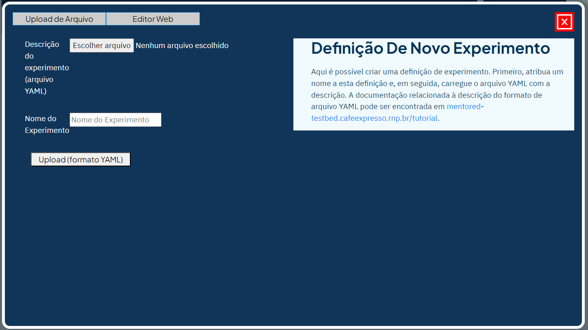

Para criar um novo experimento no MENTORED Testbed, siga estas etapas:

Clique no botão "Nova definição", conforme indicado na imagem.

Após clicar no botão, uma PopUp será aberta com informações sobre a criação do experimento.

Atualmente, a única maneira de criar um experimento é fazer o upload do arquivo .yaml que contém a topologia do experimento. Você pode encontrar informações detalhadas sobre como configurar e gravar esse arquivo no link [Como criar o arquivo YAML?] (yaml.md).

Clique no botão "Escolher arquivo" para abrir o explorador de arquivos e escolher o arquivo .yaml que deseja usar. Em seguida, no campo "Nome do Experimento", digite o nome que deseja dar à definição.

Por fim, clique em "Upload (YAML format)". Depois disso, a janela Popup será fechada e a lista de definições será atualizada com a definição recém-criada.

Com essas etapas, você pode criar um novo experimento no MENTORED Testbed.